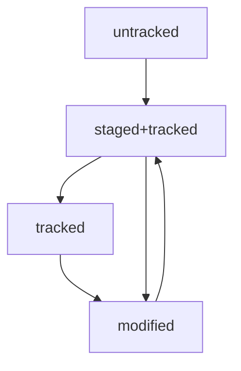

# Подсказки по работе с git

## Команды по работе с папками в Git Bash 

`PWD` - показывает путь к текущей папке

`CD` - команда для смены текущей папки на другую. Используется с указание пути к папке, на которую сменяется текущая директория.

`"~"` - используется с cd, обозначает текущую папку

`LS` - отображает содержимое текущей директории, либо указанной с командой директории(пример: ls /e/dev/first-project/)

`ls -a` - отображает все файлы директории + скрытые

`cd ..` - вернуться на уровень выше, в вышестоящую папку(пример: из /e/dev/first-project/ в /e/dev/)

`cd .` - обратиться к текущей директории

`touch` - создание файла в текущей папке. Использовать с наименованием файла и его расширением(пример: touch test.txt; touch /e/dev/first-project/test.txt)

`mkdir` - создание папки в текущей директории, использование по аналогии с touch

`mkdir -p` - позволяет создать вложенную структуру папок

`cp` - копирование. Использовать с указание что копируем, куда копируем(пример: cp test.txt /e/dev/; cp test.txt test2.txt test3.txt /e/dev/)

`mv` - перемещение. Использовать с указание что копируем, куда копируем(пример: mv test.txt /e/dev/; mv test.txt test2.txt test3.txt /e/dev/)

`cat` - вывод содержимого файла(чтение документов). Использовать с указанием файла и пути к нему, если он не в домашней директории

`rm` - удаление файла

`rmdir` - удаление директории

`rmdir -r` - последовательное удаление файлов в папке, с последующим удалением самой папки

`&&` - разделитель команд, для последовательного выполнения нескольких команда

`nano test.txt` - открывает файл для редактирования. ctrl+x - выход из файла, потребует выбрать сохранить изменения или нет(ctrl+y - да, ctrl+n - нет)

Если забыт синтаксис какой-либо команды, начав вводить ее и кликнув 2 раза на "Tab" - можно автозаполнить недостающее, либо получить список команд(если их больше одной), начинающихся на введенное значение.


## Инициализация репозитория и основные команды по работе с ним

`git init` - инициализировать папку, как git-репозиторий

`rm -rf .git` - разгитить папку(-rf - избавляет от вопросов "вы точно хотите удалить этот файл") 

`git status` - текущее состояние репозитория

`git add "file_name"` - добавляет файл в git

`git add --all` - подготавливает к сохранению все файлы в репозитории

`git add .` - добавляет всю текущую папку

`git commit` -m "Пояснение к коммиту, что было изменено"- публикация внесенных изменений. -m - пояснение к коммиту, отобразится в github

`git push` - отправка изменений на удаленный репозиторий

`git log` - отслеживание истории коммитов. Если выход из просмотра логов не произошёл автоматически, нажмите клавишу `Q` (от англ. Quit — «выйти»)

`git log --oneline`(одной строкой) - В терминале появятся только первые несколько символов хеша каждого коммита и их комментарии(умещается максимум 72 первых символа сообщения).


# Шпаргалка markdown

## Выделение текста

Вы можете выделять текст в markdown с помощью символов `_`, `~` и `*`. Например:

Пример _курсива_, **жирного**, ~зачеркнутого~ текста.

## Заголовки

Заголовки можно создавать с помощью символа `#`. Чем больше `#`, тем меньше заголовок. Например:

# Заголовок первого уровня
## Заголовок второго уровня
### Заголовок третьего уровня

## Выделение кода

Чтобы выделить текст как код, поместите его в тройные кавычки(гравис) ``````, вторая тройка грависов располагается на отдельной строке. 

```
mkdir my_project
cd my_project
git init
```

[Краткое руководство по синтаксису Markdown](https://www.markdownguide.org/cheat-sheet/ "База синтаксиса + Расширенный синтаксис")

[Подробное руководство по Markdown](https://gist.github.com/fomvasss/8dd8cd7f88c67a4e3727f9d39224a84c)

# Хеш — идентификатор коммита

`Хеширование` (от англ. hash, «рубить», «крошить», «мешанина») — это способ преобразовать набор данных и получить их отпечаток.

Информация о коммите — это набор данных: когда был сделан коммит, содержимое файлов в репозитории на момент коммита и ссылка на предыдущий, или родительский (англ. parent), коммит.

Git хеширует (преобразует) информацию о коммите с помощью алгоритма SHA-1 (от англ. Secure Hash Algorithm — «безопасный алгоритм хеширования») и получает для каждого коммита свой уникальный хеш — результат хеширования.

Обычно хеш — это короткая (40 символов в случае SHA-1) строка, которая состоит из цифр 0—9 и латинских букв A—F (неважно, заглавных или строчных). Она обладает следующими важными свойствами:

- если хеш получить дважды для одного и того же набора входных данных, то результат будет гарантированно одинаковый;

- если хоть что-то в исходных данных поменяется (хотя бы один символ), то хеш тоже изменится (причём сильно).

[Сайт для проверки хеширования с SHA-1](https://emn178.github.io/online-tools/sha1.html)

# Исследование лога

## Элементы описания коммита

После вызова `git log` появляется список коммитов.

Каждый коммит состоит из элементов:

- строка из цифр и латинских букв после слова commit — это хеш коммита;

- Author — имя автора и его электронная почта;

- Date — дата и время создания коммита;

- в конце находится сообщение коммита.

## Получение сокращённого лога — `git log --oneline`

Получить сокращённый лог можно с помощью команды git log с флагом --oneline (англ. «одной строкой»). В терминале появятся только первые несколько символов хеша каждого коммита и их комментарии.

Сокращённый лог полезен, если в репозитории уже много коммитов — например, сотни или тысячи. В этом случае можно быстро найти нужный по описанию.

Сокращённый хеш (то есть первые несколько символов полного) можно использовать точно так же, как и полный. Для этого команда `git log --oneline` автоматически подбирает такую длину сокращённых хешей, чтобы они были уникальными в пределах репозитория и Git всегда мог понять, о каком коммите идёт речь.

# Файл `HEAD`

Файл `HEAD` (англ. «голова», «головной») — один из служебных файлов папки .git. Он указывает на коммит, который сделан последним (то есть на самый новый).

Внутри `HEAD` — ссылка на служебный файл: `refs/heads/master` (или `refs/heads/main` в зависимости от названия ветки). Если заглянуть в этот файл, можно увидеть хеш последнего коммита.

Когда вы делаете коммит, Git обновляет `refs/heads/master` — записывает в него хеш последнего коммита. Получается, что `HEAD` тоже обновляется, так как ссылается на `refs/heads/master`.

Если нужно передать последний коммит, то вместо его хеша можно просто написать слово `HEAD` — Git поймёт, что имелось ввиду.

# Статусы файлов в Git

## Статусы 

- `untracked` (англ. «неотслеживаемый»)

Новые файлы в Git-репозитории помечаются как `untracked`, то есть неотслеживаемые. Git «видит», что такой файл существует, но не следит за изменениями в нём. У `untracked`-файла нет предыдущих версий, зафиксированных в коммитах или через команду `git add`.

- `staged` (англ. «подготовленный»)

  После выполнения команды `git add` файл попадает в staging area (от англ. stage — «сцена», «этап [процесса]» и area — «область»), то есть в список файлов, которые войдут в коммит. В этот момент файл находится в состоянии `staged`.
Staging area также называют index (англ. «каталог») или cache (англ. «кеш»), а состояние файла `staged` иногда называют `indexed` или `cached`.
 
- `tracked` (англ. «отслеживаемый»)

Состояние `tracked` — это противоположность `untracked`. Оно довольно широкое по смыслу: в него попадают файлы, которые уже были зафиксированы с помощью `git commit`, а также файлы, которые были добавлены в staging area командой `git add`. То есть все файлы, в которых Git так или иначе отслеживает изменения

- `modified` (англ. «изменённый»)

Состояние `modified` означает, что Git сравнил содержимое файла с последней сохранённой версией и нашёл отличия. Например, файл был закоммичен и после этого изменён.

Для файлов в состояниях `staged` и `modified` обычно не указывают, что они также `tracked`, потому что это состояние подразумевается.

## Типичный жизненный цикл файла в Git



## Как читать git status

git status показывает только следующие состояния файлов:

- `staged` (`Changes to be committed` в выводе `git status`);

- `modified` (`Changes not staged for commit`);

- `untracked` (`Untracked files`).

В выводе `git status` есть подсказка, какую команду использовать, чтобы добавить файл в список на коммит или отменить изменения.

- Команда `git status` всегда подскажет, что происходит с файлом: например, он добавлен в список «на коммит» или ещё вообще не отслеживается, или изменён.

- `git status` показывает явно следующие состояния файлов: `untracked`, `staged` и `modified`.

- `git status` подсказывает, какие команды можно выполнить, чтобы поменять состояние файла.
